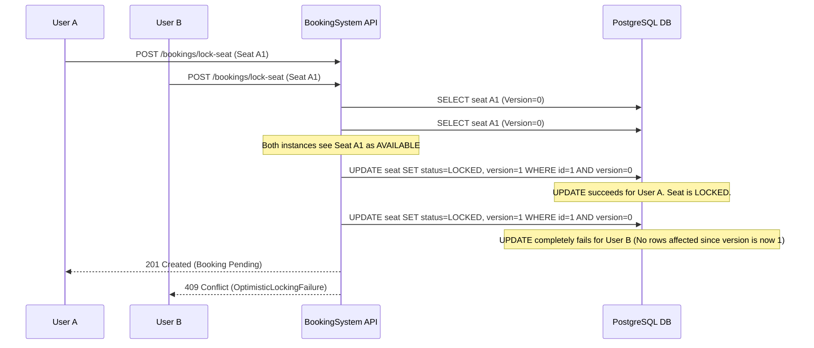
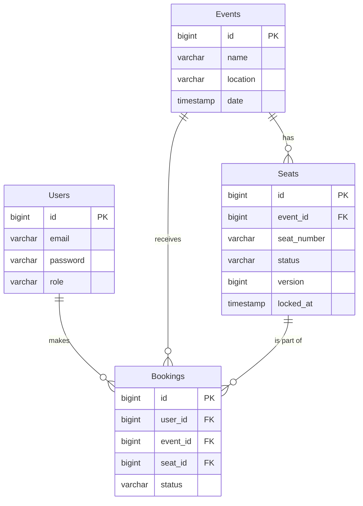

# Ticket Booking System Backend

> A concurrency-safe backend system designed to prevent double booking in high-traffic scenarios.

### 🟢 Live API Demos (Swagger UI)
- **AWS EC2 + Docker Deploy:** [http://13.201.48.116/swagger-ui.html](http://13.201.48.116/swagger-ui.html)
- **Render Cloud Deploy:** [https://ticket-booking-api-vjjy.onrender.com/swagger-ui.html](https://ticket-booking-api-vjjy.onrender.com/swagger-ui.html)

## 🛠 Tech Stack

- **Backend**: Java 21, Spring Boot 3, Spring Security
- **Database**: PostgreSQL (Production), H2 (Local)
- **ORM**: Spring Data JPA (Hibernate)
- **Migration**: Flyway
- **Authentication**: Stateless JSON Web Tokens (JWT)
- **Caching**: Spring Cache (In-Memory)
- **DevOps**: Docker, Docker Compose
- **Cloud Deployments**: AWS (EC2/RDS), Render
- **API Documentation**: Swagger UI (OpenAPI 3.0)

## 🎯 Problem Statement

Traditional ticket booking systems suffer from race conditions during high traffic, leading to double bookings and inconsistent state.

This project solves that problem by implementing a concurrency-safe booking system using Optimistic Locking and transactional guarantees.

## 👨‍💻 My Contributions

- Designed and implemented a concurrency-safe booking system using Optimistic Locking to prevent double booking.
- Built complete RESTful APIs with Spring Boot following clean layered architecture.
- Implemented JWT-based stateless authentication and role-based access control (RBAC).
- Developed seat locking mechanism with expiration using scheduled background jobs.
- Optimized database performance using indexing and solved N+1 query problem using EntityGraph.
- Integrated Flyway for schema versioning and ensured production-ready database management.
- Deployed application using Docker and configured for cloud environments (AWS/Render).

## 📚 Key Learnings

- Handling race conditions in distributed systems.
- Trade-offs between optimistic vs pessimistic locking.
- Designing REST APIs.
- Importance of database indexing and query optimization.

## 🚀 Backend Architecture Features

To ensure this application stands out in rigorous technical interviews, it implements the following backend optimizations:

*   **1. Zero Double-Bookings**: Utilizes Hibernate **Optimistic Locking (`@Version`)** to ensure data consistency and prevent double booking under concurrent requests.
*   **2. N+1 Query Eradication**: Uses Spring Data JPA `@EntityGraph` to force optimized `LEFT OUTER JOIN FETCH` queries, preventing Hibernate from executing hundreds of lazy-loading micro-queries during pagination.
*   **3. Self-Cleaning Database**: A background `@Scheduled` Cron Job runs every 60 seconds to execute an O(1) indexed query (`idx_seats_status_locked`), automatically releasing abandoned 5-minute seat locks.
*   **4. Security Validation**: Enforces strict `@Pattern` Regex on user registration (1 Upper, 1 Lower, 1 Num, 1 Special Char, min 8).
*   **5. Graceful Cloud Shutdowns**: Tomcat is configured with a 30s Graceful Shutdown timeout to prevent active database transactions from being corrupted during AWS/Render server scaling events.
*   **6. Universal Timezone Parity**: Forced JVM-wide `UTC` initialization via `@PostConstruct` ensures seat-lock expirations behave identically on local machines and distributed cloud servers.
*   **7. Data Dump Attack Prevention**: API Pagination is strictly capped (`max-page-size: 50`) to prevent malicious actors from blowing up the JVM Heap Memory.
*   **8. Stateless Authentication**: Sessions are entirely disabled (`SessionCreationPolicy.STATELESS`) in favor of horizontally scalable HMAC-SHA256 Signed JSON Web Tokens (JWT).
*   **9. CORS Vulnerability Patched**: Explictly disabled `allowCredentials(true)` when using wildcard origins to prevent modern browser preflight request failures.
*   **10. Open-In-View Disabled**: Explicitly disabled the `spring.jpa.open-in-view` anti-pattern to prevent database connection pool exhaustion.
*   **11. SLF4J Logging**: Comprehensive `log.info` injected across the Auth, Booking, and Background Scheduler lifecycles for true observability.
*   **12. ANSI Standard Database Versioning**: Complete bypass of Hibernate `ddl-auto`. Schema is strictly managed by **Flyway Migrations** (`V1__init.sql`) utilizing H2/PostgreSQL compatible `BIGINT GENERATED BY DEFAULT AS IDENTITY`.
*   **13. Clean Architecture API Contract**: DTOs isolate internal Data Entities from external API payloads. Endpoints are fully documented interactively using **Swagger UI**.
*   **14. Handled Exception Overflows**: A `@ControllerAdvice` Global Exception Handler catches `MethodArgumentNotValidException` and `OptimisticLockingFailureException`, mapping them strictly to JSON HTTP 400 and 409 codes without leaking 500 Stack Traces.
*   **15. CI/CD Ready**: Native **Maven Wrapper** and full **Docker Compose** configurations guarantee 1-click execution across any operating system or DevOps pipeline.

---

## 🏛 System Architecture & Logic Flow

### 🔄 Booking Flow (Simple)

1. User selects seat
2. System attempts to lock seat
3. If available → lock success
4. If already locked → conflict returned
5. Booking confirmed after payment

### Concurrency Flow: Optimistic Locking Sequence Diagram
This is what happens when two users attempt to book the exact same seat simultaneously.



### Entity Relationship Diagram (ERD)


---

## 🛠 Local Setup & Running the Application

### Option 1: Using Docker (Recommended for presentation)
1. Ensure Docker Desktop is running.
2. In the root directory of this project run:
```bash
docker-compose up --build
```
This single command spins up PostgreSQL and the Spring Boot application locally.
The API will be available at `http://localhost:8080`

### Option 2: Using Maven Locally (Zero Setup)
1. Ensure Java 17+ and Maven are installed.
2. Run: `mvn spring-boot:run`
   - Uses H2 in-memory database automatically (no PostgreSQL required locally).
   - Flyway runs `V1__init.sql` (schema) + `V2__seed.sql` (test data) on every startup.
   - Swagger UI available at `http://localhost:8080/swagger-ui.html`

---

## 🌩 Cloud Deployment Guides (AWS & Render)

### Deploying to Render (Free Tier Friendly)
Render allows you to deploy a Spring Boot web service and a managed PostgreSQL database easily.

1.  **Database**: Create a new "PostgreSQL" instance in Render. Copy the "Internal Database URL".
2.  **Web Service**:
    *   Create a "Web Service", connect your GitHub repo.
    *   **Build Command**: `./mvnw clean package -DskipTests`
    *   **Start Command**: `java -jar target/booking-system-0.0.1-SNAPSHOT.jar`
    *   **Environment Variables**:
        *   `SPRING_PROFILES_ACTIVE`: `prod`
        *   `DB_URL`: `jdbc:postgresql://<your-render-internal-db-url>`
        *   `DB_USERNAME`: `<from-render>`
        *   `DB_PASSWORD`: `<from-render>`
        *   `JWT_SECRET`: `your-random-64-character-hex-string`

### Deploying to AWS (EC2 + RDS)
For a more robust production environment.

1.  **RDS Setup**:
    *   Spin up a PostgreSQL RDS instance in a private subnet or secure VPC.
    *   Modify security groups to allow traffic on port 5432 from your EC2 instance.
2.  **EC2 Setup**:
    *   Spin up an Amazon Linux 2 or Ubuntu EC2 instance.
    *   Install Java 17 and Git.
    *   Clone your repository and build using `./mvnw clean package`.
3.  **Execution via Systemd**:
    *   Create a `systemd` service (`/etc/systemd/system/bookingapp.service`) to run the jar file in the background natively.
    *   Inject Environment Variables (`DB_URL`, `DB_USERNAME`, `DB_PASSWORD`, `JWT_SECRET`) within the service configuration.
    *   Run `sudo systemctl start bookingapp`.
4.  **Security**: Map the EC2 instance to an Application Load Balancer and serve over HTTPS.

---

## 📓 API Endpoints & Usage

Once running, interactive API documentation is available at:
`http://localhost:8080/swagger-ui.html`

A **Postman Collection** is included in the project root: `postman_collection.json`. Simply import this file into Postman to test all endpoints.

### Authentication Flow
1. POST `/auth/register`
   - Body requires: `{"email": "test@test.com", "password" : "pass"}`
2. POST `/auth/login`
   - Returns a JWT Token.
   - Use this token as an `Authorization: Bearer <token>` header for `/bookings/**` routes.
