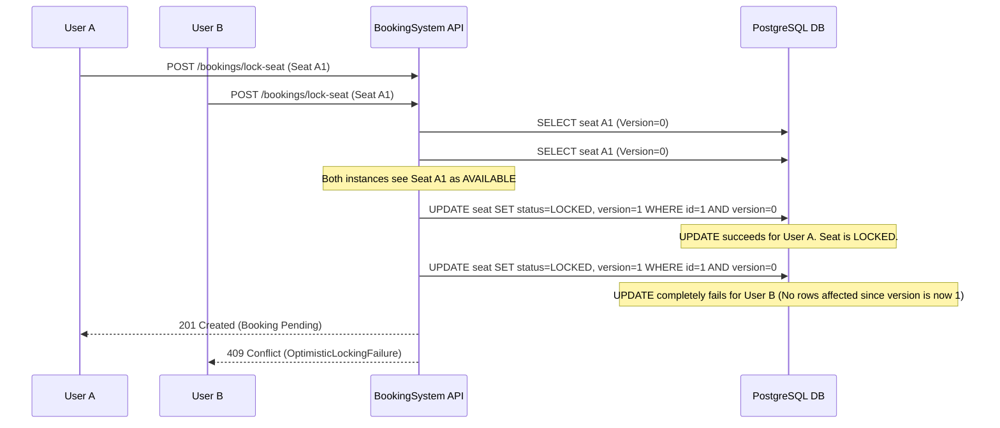
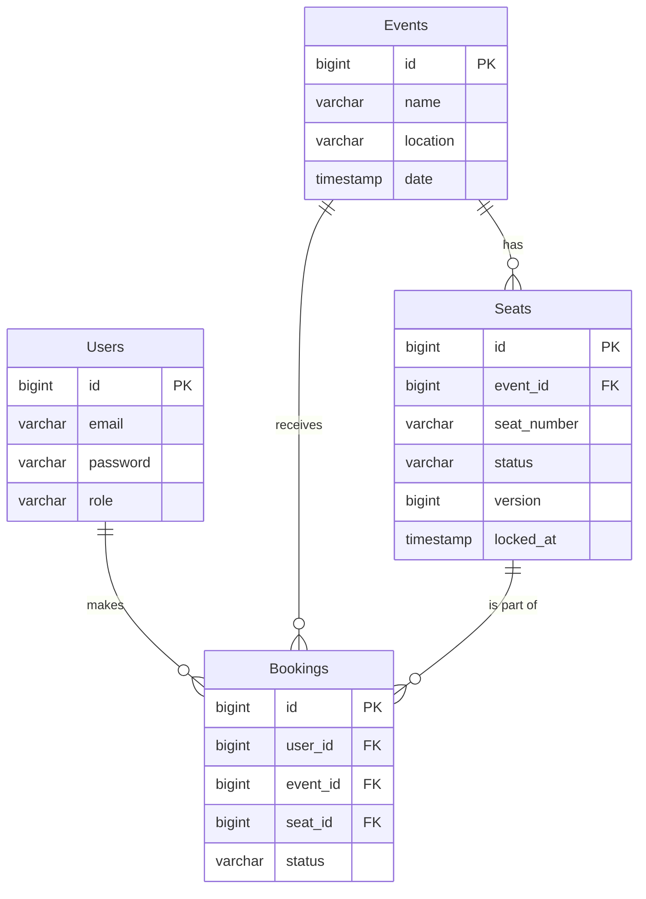

# SeatLock — Ticket Booking System Backend

> A high-concurrency ticket booking system designed to prevent double booking under race conditions.

> **System Design Insight:** Designed to handle high-contention scenarios using application-level concurrency control instead of database locking, enabling horizontal scalability without distributed lock overhead.

## 🚀 Key Highlights

- Concurrency-safe booking preventing double bookings using **Optimistic Locking** (`@Version`)
- Conflict detection with **HTTP 409** under simultaneous seat booking attempts
- **Idempotent** booking endpoints preventing duplicate requests from retries
- Seat locking with TTL expiration using **scheduled cleanup jobs**
- Eliminated **N+1 queries** using EntityGraph (JOIN FETCH optimization)
- Horizontally scalable architecture with **stateless JWT authentication**
- Production-ready with Flyway migrations, Docker deployment, and live APIs (AWS + Render)

### 🟢 Live Production System
- **🌐 Landing Page:** [https://booking.kushan.codes](https://booking.kushan.codes)
- **📚 Interactive API Docs (Swagger):** [https://booking.kushan.codes/swagger-ui/index.html](https://booking.kushan.codes/swagger-ui/index.html)
- **☁️ Render Backup:** [https://ticket-booking-api-vjjy.onrender.com/swagger-ui.html](https://ticket-booking-api-vjjy.onrender.com/swagger-ui.html)

## 🛠 Tech Stack

- **Backend**: Java 21, Spring Boot 3, Spring Security
- **Database**: PostgreSQL (Production), H2 (Local)
- **ORM**: Spring Data JPA (Hibernate)
- **Migration**: Flyway
- **Authentication**: Stateless JSON Web Tokens (JWT)
- **Caching**: Spring Cache (In-Memory)
- **DevOps**: Docker, Docker Compose
- **Cloud Deployments**: AWS (EC2/RDS), Render
- **API Documentation**: Swagger UI (OpenAPI 3.0)

## 🎯 Problem Statement

Traditional ticket booking systems suffer from race conditions during high traffic, leading to double bookings and inconsistent state.

This project solves that problem by implementing a concurrency-safe booking system using Optimistic Locking and transactional guarantees.

## 🧠 Core Engineering Decision

### Optimistic Locking vs Pessimistic Locking

- Chose **Optimistic Locking** to maximize throughput under high read scenarios.
- Avoided **Pessimistic Locking** to prevent thread blocking and database lock contention under high concurrency.
- Conflict handled at the application level using version mismatch → HTTP 409.
- **👉 Trade-off:** Higher retry rate required under extreme contention, but no threads are ever blocked waiting for locks.
- **👉 Benefit:** Better scalability, lower database lock contention, and no risk of deadlocks.
- **👉 Retry Strategy:** Clients are expected to retry on HTTP 409 conflicts using exponential backoff.

## 🚀 Backend Architecture Features

### 🔹 Concurrency & Consistency
- **Optimistic Locking (`@Version`)**: Ensures data consistency and prevents double booking under concurrent requests.
- **409 Conflict Handling**: Gracefully fails fast when a version mismatch occurs.
- **Transactional Safety**: System ensures consistency even under partial failures using transactional boundaries and retry-safe design.
- **Seat Locking with Expiry**: A background `@Scheduled` cron job releases abandoned 5-minute seat locks.

### 🔹 Performance Optimizations
- **EntityGraph**: Eradicates N+1 query problems by forcing optimized `LEFT OUTER JOIN FETCH` queries during pagination.
- **Indexed Queries**: Uses an O(1) composite index (`idx_seats_status_locked`) for the scheduling service.
- **Pagination Caps**: API Pagination strictly capped (`max-page-size: 50`) to prevent heap exhaustion.

### 🔹 Production Readiness
- **Flyway Migrations**: Complete bypass of Hibernate `ddl-auto`. Schema is strictly versioned utilizing `BIGINT GENERATED BY DEFAULT AS IDENTITY`.
- **Graceful Shutdown**: Tomcat configured with 30s timeout to prevent active transaction corruption.
- **UTC Consistency**: Forced JVM-wide `UTC` initialization ensures server parity.
- **Horizontal Scalability**: Designed to scale horizontally with stateless services and database-level concurrency guarantees.

### 🔹 Security & API Design
- **JWT Auth (Stateless)**: Sessions disabled in favor of horizontally scalable HMAC-SHA256 tokens. Designed for multi-instance deployments without sticky sessions.
- **RBAC**: Role-based access control (`@PreAuthorize`) protecting administrative endpoints.
- **Idempotent Endpoints**: Confirm and Cancel operations are idempotent, safely handling duplicate requests from network retries.
- **DTO Isolation**: Clean architecture segregating internal Data Entities from external payloads.
- **Global Exception Handling**: Mapped exceptions preventing 500 Stack Traces leakage.

---

## 🏛 System Architecture & Logic Flow

### 🔄 Booking Flow (Simple)

1. User selects seat
2. System attempts to lock seat
3. If available → lock success
4. If already locked → conflict returned
5. Booking confirmed after payment

### Concurrency Flow: Optimistic Locking Sequence Diagram
This is what happens when two users attempt to book the exact same seat simultaneously.



### Entity Relationship Diagram (ERD)


---

## 🚦 Load & Contention Testing (Grafana k6)

The system is bundled with a comprehensive `k6` load testing suite (`k6-stress-test.js`) covering **3 distinct scenarios** to validate correctness, performance, and resilience.

### Scenario 1: Seat Contention Race (Optimistic Locking Validation)
Simulated a high-contention scenario where **50 concurrent Virtual Users** attempt to book the **exact same seat** simultaneously.

```text
  ✗ [Contention] is success (201)
    ↳  1% — ✓ 1 / ✗ 99
  ✗ [Contention] is conflict (409)
    ↳  99% — ✓ 99 / ✗ 1
  ✓ [Contention] no crash (500)
```
*Result: Exactly 1 user acquired the lock, 99 were safely rejected with `409 Conflict`. Zero deadlocks, zero data corruption.*

### Scenario 2: Sustained Read Load (Caching & EntityGraph Validation)
**20 VUs** continuously hit paginated event endpoints for 15 seconds.

```text
  ✓ [Sustained] events 200 OK
  ✓ [Sustained] events < 300ms
  ✓ [Sustained] event detail 200 OK
```
*Result: All read operations completed under 300ms. Spring Cache and EntityGraph optimizations validated under pressure.*

### Scenario 3: Spike Test (Auth Endpoint Resilience)
Ramped from **0 → 30 VUs instantly**, hammering registration and login endpoints.

```text
  ✓ [Spike] register 2xx
  ✓ [Spike] register < 500ms
  ✓ [Spike] login 200 OK
  ✓ [Spike] login < 500ms
```
*Result: Server remained stable under sudden traffic bursts. No 500 errors, all responses under 500ms.*

### Performance Thresholds (All Passed ✓)
```text
  booking_lock_latency: p(90)=97.75ms   (threshold: p(90)<300ms) ✓
  http_req_duration:    p(95)=70.1ms    (threshold: p(95)<500ms) ✓
  total_requests:       2,380 across 32.7s (72.8 req/s)
```

---

## 🛠 Local Setup & Running the Application

### Option 1: Using Docker (Recommended for presentation)
1. Ensure Docker Desktop is running.
2. In the root directory of this project run:
```bash
docker-compose up --build
```
This single command spins up PostgreSQL and the Spring Boot application locally.
The API will be available at `http://localhost:8080`

### Option 2: Using Maven Locally (Zero Setup)
1. Ensure Java 17+ and Maven are installed.
2. Run: `mvn spring-boot:run`
   - Uses H2 in-memory database automatically (no PostgreSQL required locally).
   - Flyway runs `V1__init.sql` (schema) + `V2__seed.sql` (test data) on every startup.
   - Swagger UI available at `http://localhost:8080/swagger-ui.html`

---

## 🌩 Cloud Deployment Guides (AWS & Render)

### Deploying to Render (Free Tier Friendly)
Render allows you to deploy a Spring Boot web service and a managed PostgreSQL database easily.

1.  **Database**: Create a new "PostgreSQL" instance in Render. Copy the "Internal Database URL".
2.  **Web Service**:
    *   Create a "Web Service", connect your GitHub repo.
    *   **Build Command**: `./mvnw clean package -DskipTests`
    *   **Start Command**: `java -jar target/booking-system-0.0.1-SNAPSHOT.jar`
    *   **Environment Variables**:
        *   `SPRING_PROFILES_ACTIVE`: `prod`
        *   `DB_URL`: `jdbc:postgresql://<your-render-internal-db-url>`
        *   `DB_USERNAME`: `<from-render>`
        *   `DB_PASSWORD`: `<from-render>`
        *   `JWT_SECRET`: `your-random-64-character-hex-string`

### Deploying to AWS (EC2 + RDS)
For a more robust production environment.

1.  **RDS Setup**:
    *   Spin up a PostgreSQL RDS instance in a private subnet or secure VPC.
    *   Modify security groups to allow traffic on port 5432 from your EC2 instance.
2.  **EC2 Setup**:
    *   Spin up an Amazon Linux 2 or Ubuntu EC2 instance.
    *   Install Java 17 and Git.
    *   Clone your repository and build using `./mvnw clean package`.
3.  **Execution via Systemd**:
    *   Create a `systemd` service (`/etc/systemd/system/bookingapp.service`) to run the jar file in the background natively.
    *   Inject Environment Variables (`DB_URL`, `DB_USERNAME`, `DB_PASSWORD`, `JWT_SECRET`) within the service configuration.
    *   Run `sudo systemctl start bookingapp`.
4.  **Security**: Map the EC2 instance to an Application Load Balancer and serve over HTTPS.

---

## 📓 API Endpoints & Usage

Once running, interactive API documentation is available at:
`http://localhost:8080/swagger-ui.html` or the live version at [`https://booking.kushan.codes/swagger-ui/index.html`](https://booking.kushan.codes/swagger-ui/index.html)

A **Postman Collection** is included in the project root: `postman_collection.json`. Simply import this file into Postman to test all endpoints.

### Authentication Flow
1. POST `/auth/register`
   - Body requires: `{"email": "test@test.com", "password" : "pass"}`
2. POST `/auth/login`
   - Returns a JWT Token.
   - Use this token as an `Authorization: Bearer <token>` header for `/bookings/**` routes.

---

## 🔮 Future Improvements

- Introduce **Redis-based distributed locking** for multi-instance consistency across horizontally scaled nodes
- Add **queue-based seat reservation** (e.g., Kafka/RabbitMQ) for extreme traffic scenarios with backpressure handling
- Implement **Idempotency Keys** on the lock-seat endpoint to prevent duplicate bookings from client-side retries
- Add **Prometheus + Grafana** monitoring dashboards for real-time booking throughput and error rate visualization
